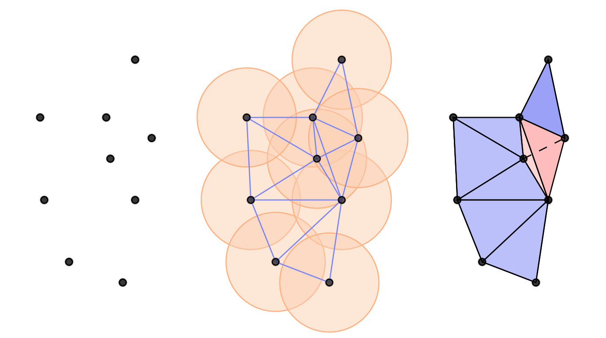

# E(n) Equivariant Message Passing Simplicial Networks :small_red_triangle:

The official code base for $\mathrm{E}(n)$ Equivariant Message Passing Simplicial Networks (ICML 2023). Work by Floor Eijkelboom, Rob Hesselink, and Erik Bekkers. 

arXiv link: https://arxiv.org/pdf/2305.07100.pdf

<p align="center">

</p>

## Paper abstract

This paper presents $\mathrm{E}(n)$ Equivariant Message Passing Simplicial Networks (EMPSNs), a novel approach to learning on geometric graphs and point clouds that is equivariant to rotations, translations, and reflections. EMPSNs can learn high-dimensional simplex features in graphs (e.g. triangles), and use the increase of geometric information of higher-dimensional simplices in an $\mathrm{E}(n)$ equivariant fashion. EMPSNs simultaneously generalize $\mathrm{E}(n)$ Equivariant Graph Neural Networks to a topologically more elaborate counterpart and provide an approach for including geometric information in Message Passing Simplicial Networks. The results indicate that EMPSNs can leverage the benefits of both approaches, leading to a general increase in performance when compared to either method. Furthermore, the results suggest that incorporating geometric information serves as an effective measure against over-smoothing in message passing networks, especially when operating on high-dimensional simplicial structures. Last, we show that EMPSNs are on par with state-of-the-art approaches for learning on geometric graphs.

## Requirements

The code is written in PyTorch (v2.1) and Python 3.9. The topology-related code is implemented usin Gudhi (https://gudhi.inria.fr/index.html).

To create the environment, run the following command:

```conda env create -f environment.yaml```

Then simply activate the environment as follows:
    
```conda activate empsn```

## Reproduce results

To reproduce the results of the paper for QM9 -- e.g. for the $H$ property -- simply run the following command:

```python main_qm9.py --target_name H --epochs 1000 --dis 4.0 --dim 2 --num_hidden 77 --seed 42```

The above code base provides better performance than the original paper described after some more architecture search. A table will follow soon.
